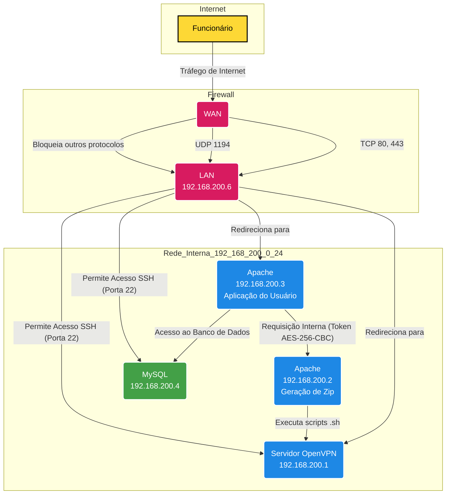

# 🔐 Infraestrutura de Rede com Firewall, OpenVPN e Aplicações Web

Este repositório documenta uma infraestrutura de rede baseada em um firewall com regras específicas, servidores Apache, banco de dados MySQL e acesso remoto via OpenVPN. Ideal para ambientes seguros com aplicações web internas e externas.

---

## 📌 Diagrama da Arquitetura

## Componentes Principais

### 1. Firewall (192.168.200.6 - WAN/LAN)
- Ponto de entrada e saída para todo o tráfego de Internet.
- Permite:
  - HTTP (porta 80/TCP) e HTTPS (porta 443/TCP) para o servidor Apache da Aplicação do Usuário (192.168.200.3).
  - UDP (porta 1194/UDP) para o servidor OpenVPN (192.168.200.1), garantindo conexões remotas seguras via VPN.
- Bloqueia todo outro tráfego/protocolo da Internet para servidores internos, minimizando superfície de ataque.
- Permite acesso SSH (porta 22/TCP) **somente** a partir da rede interna (192.168.200.0/24) para:
  - Servidor OpenVPN
  - Banco de Dados MySQL

### 2. Aplicação do Usuário (VpnHub) (Apache - 192.168.200.3)
- Servidor principal que hospeda a aplicação web, acessível externamente via firewall.
- Realiza comunicação com:
  - Banco de Dados MySQL (192.168.200.4) para operações de leitura e escrita.
  - Servidor de Geração de Zip (192.168.200.2) através de requisições internas protegidas por token AES-256-CBC.

### 3. Aplicação de Geração de Zip (TunnelPacker) (Apache - 192.168.200.2)
- Servidor secundário que processa e gera arquivos ZIP.
- Executa scripts `.sh` que interagem diretamente com o Servidor OpenVPN (192.168.200.1) para funcionalidades específicas da VPN.

### 4. Servidor OpenVPN (192.168.200.1)
- Permite acesso remoto seguro à rede interna via túnel VPN para funcionários autorizados.
- Recebe comandos do Servidor de Geração de Zip via execução de scripts.

### 5. Banco de Dados MySQL (192.168.200.4)
- Armazena dados da aplicação do usuário.
- Acessível somente pela Aplicação do Usuário na rede interna e para administração via SSH dentro da rede interna.
- Tem usuário apenas para developers@192.168.200.3
---

## Fluxo de Comunicação

1. O Firewall gerencia todo o tráfego entre a rede interna e externa, garantindo segurança e controle rigoroso dos protocolos permitidos.
2. A Aplicação do Usuário é acessada externamente via HTTP/HTTPS, realiza operações no banco de dados e interage com o Servidor de Geração de Zip de forma segura usando tokens criptografados.
3. O Servidor de Geração de Zip cria arquivos ZIP e controla funcionalidades da VPN executando scripts no Servidor OpenVPN.
4. O Servidor OpenVPN oferece acesso remoto seguro à rede interna.
5. O Banco de Dados MySQL é protegido e acessível apenas internamente para a aplicação e administração.

---

## Segurança

- O acesso SSH é restrito à rede interna.
- O tráfego externo é limitado a portas e protocolos essenciais.
- Comunicação entre servidores sensíveis utiliza criptografia (token AES-256-CBC).
- Scripts e comandos entre servidores são controlados e monitorados.

---
